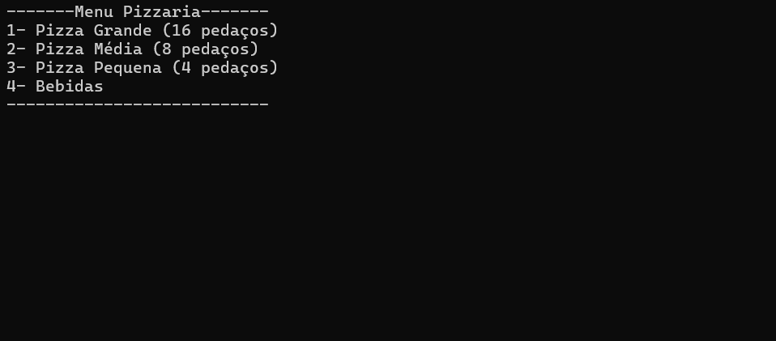
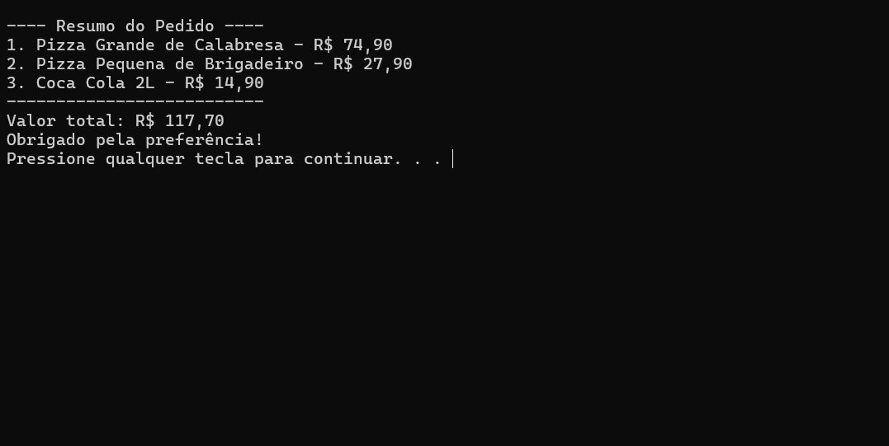

# 🍕 Pizzaria em C  

  
  
  
  

---

## 📖 Sobre o projeto
Este projeto é um sistema simples de **pedidos de pizzaria** desenvolvido em **linguagem C**.  
O usuário pode escolher pizzas de diferentes tamanhos e sabores, além de bebidas, e no final recebe um **resumo completo do pedido com o valor total**. 
O sistema também **salva automaticamente cada pedido em um arquivo `.txt`** — o nome do arquivo é gerado **com base na data e no horário atual**, garantindo que cada pedido seja armazenado em um arquivo único, sem sobrescrever os anteriores.
---

## 📋 Funcionalidades
- Exibe um menu interativo de opções de pizza e bebidas.  
- Permite escolher entre **tamanhos diferentes** (grande, média, pequena).  
- Oferece pizzas salgadas e doces.  
- Inclui opções de bebidas em 1L e 2L.  
- Armazena os itens escolhidos em um vetor.  
- Mostra um **resumo do pedido** com todos os itens e o preço total.  
- **Salva automaticamente o pedido em um arquivo `.txt`** dentro da pasta do projeto.
     - O nome do arquivo é gerado **com base na data e hora do pedido**, garantindo que cada arquivo seja único.
---

## 🛠️ Tecnologias utilizadas
- **C (Linguagem de Programação)**  
- Estruturas de repetição e condicionais  
- Vetores e manipulação de strings
- Manipulação de arquivos com `fprintf()` e `fopen()`  

**Bibliotecas utilizadas:**  
- `<stdio.h>` → entrada, saída e manipulação de arquivos (`scanf`, `printf`, `fprintf`, `fopen`) 
- `<stdlib.h>` → funções do sistema (`system`, `pause`)  
- `<locale.h>` → configuração de idioma (acentos em português)  
- `<string.h>` → manipulação de strings (`strcpy`)  
- `<time.h>`   → obter a data e o horário atual (`time()`, `localtime()`, `struct tm`)
---

## 📚 Conceitos de programação aplicados
- Uso de **condições aninhadas** (`if` dentro de `if`).  
- Estrutura de repetição **do...while** para manter o menu ativo.  
- Manipulação de vetores para armazenar pedidos e preços.  
- Construção de um **menu interativo** no terminal.  
- Escrita de dados em **arquivos externos (`.txt`)**.

---

## 🎮 Exemplo de uso

```text
-------Menu Pizzaria-------
1- Pizza Grande (16 pedaços)
2- Pizza Média (8 pedaços)
3- Pizza Pequena (4 pedaços)
4- Bebidas
---------------------------

---- Resumo do Pedido ----
1. Pizza Média de Calabresa - R$ 37.90
2. Coca Cola 2L - R$ 14.90
--------------------------
Valor total: R$ 52.80
Obrigado pela preferência!
Pedido salvo no arquivo 'Pedido_20251113_103232.txt'!
Pressione qualquer tecla para continuar. . .
```
## 🖼️ Demonstração (prints do terminal)

### Menu principal


### Resumo do pedido
 

## 💡 Melhorias futuras
- 🎁 Implementar descontos em combos.  
- ✏️ Permitir edição/remoção de itens do pedido.  
- 🗂️ Criar um sistema de cadastro de clientes.   

---

## 🌐 Teste online
Você pode executar o código direto no navegador aqui:  
[Executar Pizzaria em C](https://onlinegdb.com/8ZVfzBwXzk)
> ⚠️ **Observação:** A versão disponível no navegador **não salva os pedidos em arquivos `.txt`**, pois o ambiente online não permite manipulação de arquivos locais.  
> Essa funcionalidade está disponível **apenas na versão completa do projeto**, executada localmente no computador.

---

## 🎥 Demonstração em vídeo
Assista à explicação completa do projeto no meu LinkedIn:  
[](https://www.linkedin.com/posts/danilomalheiro_c-programaaexaeto-linguagemc-activity-7379648989153087488-tUBS?utm_source=share&utm_medium=member_desktop&rcm=ACoAAFOnXWQByj8ti76jmrxtKPek7KLI53N59ao)
> ⚠️ **Nota:** O vídeo demonstra uma **versão anterior do projeto**, gravada **antes da implementação da função de salvar pedidos em arquivos `.txt`**.

## 📌 Autor
Feito por **Danilo Malheiro**  
👉 [LinkedIn](https://www.linkedin.com/in/danilo-malheiro-658031332/)
